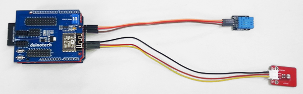
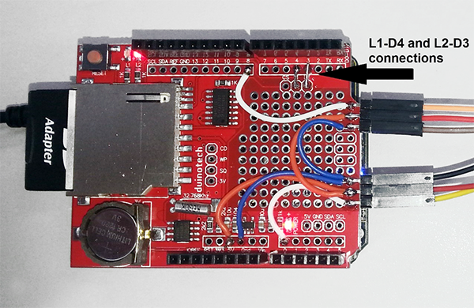
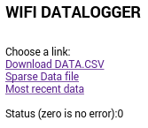
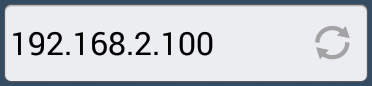
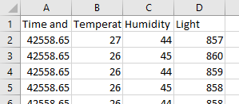
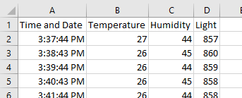
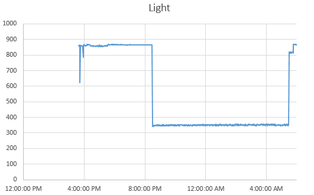

# WiFi Environmental Datalogger

<deprecated />

This project has been replaced by [Jaycar-Electronics/Motherload-datalogger](https://jaycar.com.au/motherload-datalogger) - Use the below modules with the motherload-datalogger project if you require a WiFi Environmental Datalogger. This project is now archived and is not supported.

Another handy Arduino based tool to add to your workbench, the Environmental Datalogger measures temperature, humidity and light levels and logs it to an SD card with the time of the reading. The data is saved as a .csv file, which will open straight into the Excel spreadsheet program to allow it to be easily graphed and analysed. It is also hosts a minimal web-server, which allows the log files to be downloaded over Wi-Fi. Other features include:

- Diagnostic LED to show error status
- Card activity LED so you can that it's logging
- Years of data storage possible

And being Arduino based, you can customise it to suit whatever data you want to log. There's a little bit of soldering required, so it's not quite plug and play.



## Shopping List:

| Qty | Code                                    | Description                     |
| --- | --------------------------------------- | ------------------------------- |
| 1   | [XC4410](http://jaycar.com.au/p/XC4410) | Uno main board                  |
| 1   | [XC4614](http://jaycar.com.au/p/XC4614) | WiFi shield                     |
| 1   | [XC4536](http://jaycar.com.au/p/XC4536) | Datalogging shield              |
| 1   | [XC4446](http://jaycar.com.au/p/XC4446) | LDR module                      |
| 1   | [XC4520](http://jaycar.com.au/p/XC4520) | Temperature and Humidity Module |
| 1   | [WC6026](http://jaycar.com.au/p/WC6026) | socket-socket jumper leads      |
| 1   | [XC4983](http://jaycar.com.au/p/XC4983) | 8GB Micro SD card with adaptor  |
| 1   | [HM3211](http://jaycar.com.au/p/HM3211) | Header Terminal Strip           |

## Connections:

The first step is to complete the physical build. Nearly all the connections are made on the prototyping area of the Datalogging Shield, then the Wi-Fi shield is plugged over the top Because all the connections to the Uno are made through the Datalogging Shield, there are no direct Uno connections listed, and they can be assumed to be the same as the Datalogging Shield:

| Data Shield | Temp and Humidity Sensor | Wi-Fi Shield | Light Sensor | Function                        |
| ----------- | ------------------------ | ------------ | ------------ | ------------------------------- |
| L1-D4       |                          |              |              | Diagnostic LED                  |
| L2-D3       |                          |              |              | Card Use LED                    |
| 5V          | (middle pin)             | 5V           | VCC          | Power                           |
| GND         | -                        | GND          | GND          | Ground                          |
| A0          |                          |              | OUT          | Analog signal from light sensor |
| D8          | S                        |              |              | Data Signal                     |
| D0(RX)      |                          | TX           |              | Data from Wi-Fi Shield          |
| D1(TX)      |                          | RX           |              | Data to Wi-Fi Shield            |

We've made the connections using short offcuts of the jumper leads- blue for the ground, orange for the 5V and white for the signals from the sensors, which have been wired to a small three pin piece of the header strip (it breaks easily at the small notches between the pins). This makes it easier to change out the sensor modules if you want to log a different type of data. The connections between L1-D4 and L2-D3 are made with small pieces of wire too.



Notice how we've kept the connections clear of the white box which outlines the ISP header- this can make it easier to do some upgrades in the future.

The final step is to connect the sensors to the board via the jumper leads and then attach the shield to the Uno board, and connect the Wi-Fi shield to the top of the Datalogging Shield. Don't forget to put the card in the socket too.

## Code:

The Wi-Fi Environmental Datalogger sketch uses a number of libraries, but most of these are included in recent builds of the Arduino IDE. The only one you might need to download is the library for the Real-Time Clock chip on the Datalogging shield, and is linked [here](https://github.com/adafruit/RTClib) . If you've previously done[one of the clock projects](http://www.jaycar.com.au/diy-arduino-clock) , you might already have this library installed.  
Before uploading the code, turn the small white switches on the Wi-Fi shield to the 'off' position (closest to 1 2). This is because the Wi-Fi shield uses the serial port, and can interfere with the serial port during programming. Open the sketch and find these lines near line 37:

```cpp
#define SSIDNAME "Arduino"
#define SSIDPWD "Arduino!"
```

You should change these to the name and password of the Wi-Fi network you'll be using. Then upload the code, making sure you have 'Uno' selected as the board type. Note that because of the way this sketch uses SPI and I2C, only the Uno will work for this project. After the code is successfully uploaded, put the white switches back to the on position and press the reset button on the Uno- this ensures that the Wi-Fi shield receives all the commands it needs to work.

Most of the hard work is done by the libraries- the sketch uses the libraries to check that the card and real-time clock are working and to get the time from the real-time clock and write the data to the card.

Insert the card into the slot and check that the LED's only flash briefly. If they keep flashing, you might have a card or RTC error. You can check which error it is by counting the flashes:

| Flashes   | Meaning                                       |
| --------- | --------------------------------------------- |
| 1 Flash   | Card not detected                             |
| 2 Flashes | RTC not detected                              |
| 3 Flashes | RTC not running                               |
| 4 Flashes | Cannot open file                              |
| 5 Flashes | Cannot write to card (probably card is full). |

If the time is not correct or you have an RTC error, then you might need to temporarily load the ds1307 example sketch from File>Examples>RTClib, and use that to check the RTC and set the time. If you get an SD card error, check that the card is formatted to FAT or FAT32 and has enough space available.

After the sketch starts, it should start logging data every minute, and you should also see the L2 LED flash briefly every minute- this is when the card is being written too, and you should avoid turning the Datalogger off at this time, as that will cause card errors. If you want to check the data, wait until the LED is off, and then power off the Datalogger, and read the card with a computer.

## Wi-Fi Access:

The Datalogger serves a very basic web page to allow you to download either the entire log file (which could take a while, as the Wi-Fi shield can only send about 500 bytes/second), a sample of every 60th data point, or the most recent 2kB of data. There is also a status line, where the status code is the same as the number of flashes the LED would give.



To access the webpage, you'll need to know its IP address on the network. We use an app called NetworkScanner on Android to find network devices. Alternatively, most routers should show the MAC address of connected devices in their DHCP client list- look for a MAC address that starts with "18:", and type the corresponding IP address into your browser:



You can click on any of the links to download the corresponding data file. The Uno is very busy trying to keep up with Datalogging and serving pages, so don't be surprised if it's slow or takes a few tries to download the data. Remember too that while the Datalogger is serving a file, it can't log data, so you might miss some samples while downloading the complete data file.

## Using the Data:

If you have Excel installed, you can double-click the DATA.CSV file, and you should get something like the following:



You can widen the columns, and improve the Time and Date column by changing the format of column A:



The data can be graphed by selecting column A and one of the other columns, and inserting a chart:



If you save it now, none of the formatting or charts can be saved under the .csv file format, and the Datalogger won't be able to read the .xls format, so it's best to make a copy of the data and edit that.

## Improvements:

The Datalogger is very configurable- the logging interval can be set by the #define LOGINTERVAL command near the start of the sketch- this is measured in seconds, and the fastest rate is about one sample per second. Even at this rate, it should not run out of space for many years. With the default settings, we are getting about 35kB per day at one sample per minute, which equates to about 25 bytes per sample.

The Wi-Fi webserver is set to give every 60th sample in the 'Sparse' file- this equates to once per hour, and can be changed in this line:

```cpp
if(strmatch("SPARSE.CSV",fname)){
    sendcsvsparse(60);crcount=0;
    } //serve file with every nth sample
```

The 'Recent' file option can be changed in the line straight after, where the 2000 is the approximate number of bytes that get delivered:

```cpp
if(strmatch("RECENT.CSV",fname)){
    sendcsvrecent(2000);
    crcount=0;
    }  //serve header, and approximately last n (will typically be slightly more)
```

The web pages that get served up are defined in the #define HTTP lines near the start of the sketch, and can of course be customized too.

The default light sensor is simply having the raw analog signal (0-1023) logged, so this should suit any analog sensor, and it's possible to process the data afterwards in Excel if you have an equation you can use. Alternatively, you could convert the value in the sketch if you want to be able to immediately export the data. If you've used the header pins on the edge of the board it's easy to connect most of the other duinotech analog sensors. For example, add the [Soil Moisture Sensor](https://jaycar.com.au/p/XC4604) to keep track of when the garden might need watering, or the[Ultraviolet Sensor Module](https://jaycar.com.au/p/XC4518) to see how much sun the plants are getting.

The temperature and humidity are in degrees Centigrade and percent Humidity, because this is what the sensor reports directly. If you have another sensor you'd like to use, you'd need to import the code to read that sensor into the `getvalue()` function, unless it is a simple analog or digital type. If you need to log more different sensor values, then they can be added to `logtocard()` function, and will need to have the headers edited in the `addheaders()` function so that their names are reported correctly.

The default Wi-Fi setting are for the Datalogger to connect to an existing Wi-Fi hotspot. If you'd like to set up the Datalogger to create its own hotspot, replace the following lines in the `wifiinit()` function:

```cpp
WIFIcmd("AT+CWQAP",ok,5000);         //exit any AP's
WIFIcmd("AT+CWJAP=\""SSIDNAME"\",\""SSIDPWD"\"","WIFI GOT IP\r\n",10000);  //join AP
WIFIcmd("ATE0",ok,1000);           //turn echo off
WIFIcmd("AT+CWMODE=1",ok,2000);    //station mode only
```

With:

```cpp
WIFIcmd("AT+CWMODE=2",ok,2000); //AP mode only
WIFIcmd("AT+CWSAP=\""SSIDNAME"\",\""SSIDPWD"\",11,3,4",ok,10000); //set up AP
WIFIcmd("ATE0",ok,1000);   //turn echo off
```

The next thing we would do with the Datalogger is make it portable- perhaps put it in an enclosure and run it from batteries (via the DC jack) or a USB battery pack (via the USB port). Then it can be left somewhere to run independently.

## Code

Note that you will need to install the

- [RTClib library](https://github.com/adafruit/RTClib)
  as well.
